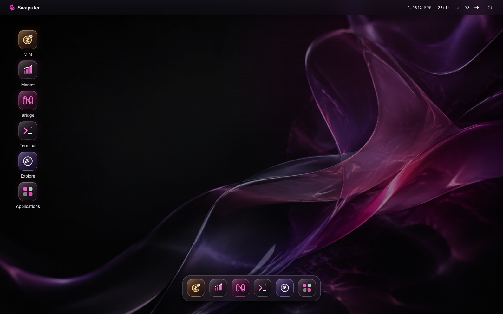

# Swaputer Computer

A wallet-powered home for Swaputer applications. Power on with your wallet, then open Mint, Market, Bridge or Terminal.

A dark Liquid Glass desktop on larger screens and an iOS-inspired home screen on phones, with smooth app icons and the Swaputer graphite-and-magenta palette.



Your connected wallet's ETH balance appears at the top right on desktop. Select it to view your address, copy it, or disconnect. The mobile home screen intentionally omits wallet and balance chrome. Balance reads refresh periodically; an unavailable balance shows a dash, not zero.

On a computer, click an app icon or launch it from the Dock. Mint, Market, Bridge and Terminal open in a centered window that can move, resize, minimize and maximize. The desktop keeps one application window at a time: opening another app closes the previous one. Explore opens the protocol explorer in a separate tab. Use Applications to search by app name. `⌘K` / `Ctrl+K` opens the application library; `Alt` + arrow keys moves a focused window title bar. Swaputer is a static brand in the system bar; the power icon at the far right opens a shutdown confirmation.

On a phone, tap an app on the home screen. Each app opens full screen. There is no mobile Dock; Applications is a home-screen app. The Home bar returns to the home screen, and the running-apps button lets you switch between open apps. App inputs survive switching and minimizing within the session.

## Applications

- **Mint** verifies a public-mint SRC20 contract, displays its supply and mint progress, and mints to the connected wallet. Create SRC20 deploys a new token using the public mint template.
- **Market** discovers SRC20 markets, lists tokens, makes offers, fills or cancels orders, and shows trade history.
- **Bridge** deposits ETH for sETH or redeems sETH for ETH, with reserve information and execution-fee controls.
- **Terminal** combines Computer's read-only browser verifier adapter with published Swaputer verification modules for `inspect`, `decode-receipt`, `help`, `version` and `clear` commands.
- **Explore** opens the protocol explorer in a separate browser tab.

The Terminal uses transaction inspection from the published `@swaputer-labs/cli@0.1.2` package and receipt decoding from `@swaputer-labs/receipt-codec@0.1.2`. Because CLI 0.1.2 does not publish a browser export and its root barrel also loads Node-only deployment helpers, Computer imports the exact browser-safe inspection modules through a documented internal adapter. See [Browser CLI adapter provenance](docs/browser-cli-adapter.md). No repacked package or sibling repository is required.

The included release is Base Sepolia. Connecting a wallet does not sign or send a transaction. Transaction actions request confirmation in the wallet. Account or network changes lock the desktop and require reconnection.

Computer serializes protocol writes so two applications cannot reuse the same action nonce. If a wallet or RPC cannot determine a submitted transaction's final status, Computer preserves the full transaction hash for Explorer reconciliation and blocks further writes until the page is reloaded.

Use an injected EVM browser wallet on desktop, or open the site in an EVM wallet's built-in mobile browser. Ordinary mobile Safari/Chrome without an injected wallet cannot connect in this version; WalletConnect is not integrated. Power off clears the local session; it does not revoke the wallet's site permission.

## Development

Requires Node.js 22.12 or later.

```sh
npm ci
npm run dev
```

Open `http://127.0.0.1:4175`. The development server forwards `/api` to the indexer at `http://127.0.0.1:8080`. Configure `.env.local` using the settings in `.env.example`:

| Setting | Purpose |
| --- | --- |
| `VITE_SVM_API_URL` | Indexer HTTP/WebSocket base, normally `/api` |
| `INDEXER_PROXY_URL` | Development proxy destination |
| `VITE_PROTOCOL_EXPLORER_URL` | Protocol explorer for contract, address and transaction links |
| `VITE_RPC_URL` | Optional read-only RPC endpoint |

Contract addresses and release scope are pinned in `config/base-sepolia.json`. The app uses the published `@swaputer-labs/tinysol` compiler and includes the matching contract sources. No sibling repository or submodule is required to install or build it.

## Verification

```sh
npm test
npm run build
npx playwright install chromium
npx playwright test
```

Browser tests use a simulated wallet and never submit real transactions. On macOS they use the installed Google Chrome. Package identity tests compile both bundled contract sources and compare their hashes against the release manifest.

## Deployment

```sh
npm run build
```

Serve `dist/` with HTTPS and proxy `/api/` to the indexer, including WebSocket upgrades. Set `VITE_PROTOCOL_EXPLORER_URL` before building. Hash links such as `/#/minter?contract=0x…` preserve the destination through wallet connection.

A standalone Docker build is also provided:

```sh
docker build --pull --build-arg VITE_PROTOCOL_EXPLORER_URL=https://YOUR_EXPLORER_HOST -t swaputer-computer .
docker run --rm -p 127.0.0.1:4175:8080 -e INDEXER_ORIGIN=http://YOUR_INDEXER_HOST:8080 swaputer-computer
```

The protocol explorer's `VITE_COMPUTER_URL` should point to this app. Its old Mint, Market and Bridge links then forward to the corresponding installed application.
